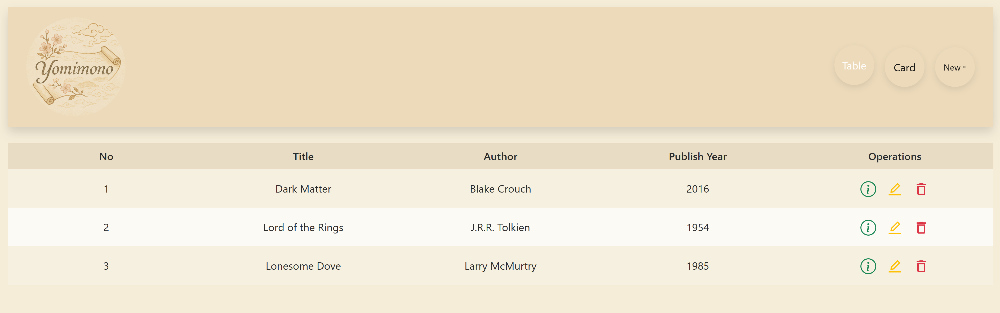

# 📚 Yomimono – Book Manager Frontend

**Yomimono** (読み物) means "reading material" in Japanese. This elegant, parchment-themed React frontend is part of a full-stack MERN application for managing a personal book collection. Featuring Japanese aesthetic inspirations and intuitive UI, Yomimono lets you add, view, edit, and delete books with ease.



---

## 🌟 Features

- 🎴 **Card & Table Views** – Toggle between aesthetic cards and efficient tables  
- ✏️ **CRUD Operations** – Create, read, update, and delete books  
- 🎨 **Japanese Parchment UI** – Soft, elegant styles with parchment textures and custom fonts  
- 🚀 **Toast Notifications** – Friendly feedback on every action using Notistack  
- 📱 **Responsive Design** – Works beautifully on desktop and mobile  

---

## 📂 File Structure

```txt
frontend/
│
├── components/
│ ├── BackButton.jsx
│ ├── Spinner.jsx
│ └── home/
│ ├── BooksCard.jsx
│ └── BooksTable.jsx
│
├── pages/
│ ├── Home.jsx
│ ├── CreateBook.jsx
│ ├── EditBook.jsx
│ ├── DeleteBook.jsx
│ └── ShowBook.jsx
│
├── NavBar.jsx
├── App.jsx
├── main.jsx
├── public/
│ └── yomimono-preview.png
├── .env
└── vite.config.js
```


---

## 🧠 Tech Stack

- **React**
- **Bootstrap 5**
- **Axios**
- **React Router DOM**
- **Notistack** (for toast notifications)
- **Vite** (for fast dev builds)

---

## 🚀 Getting Started

### 1. Clone the Repository

```bash
git clone https://github.com/your-username/bookstore-MERN-stack-frontend.git
cd bookstore-MERN-stack-frontend
```

2. Install Dependencies
```bash
npm install
```

3. Set Environment Variables
Create a .env file in the root directory and add:

VITE_API_URL=http://localhost:5555

Make sure this matches the base URL of your backend.

4. Run the Development Server
```bash
npm run dev
```

📄 License
This project is licensed under the MIT License.
You are free to use, modify, and distribute this app with attribution.

👤 Author
Made with ❤️ by Joshua Atendido Bear
Inspired by traditional Japanese paper scrolls.